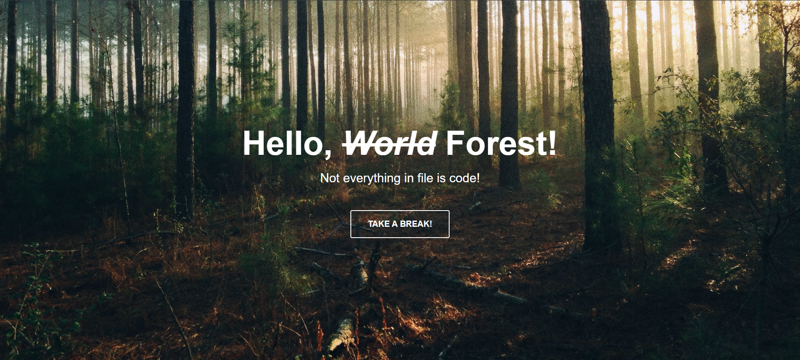

# Hello Forest

En este proyecto creamos una pagina web utilizando HTML5 y CSS3.

Hacemos uso de una caja flexible para el fácil acomodo de los elementos dentro de ella.

### Características
- **Diseño Responsive:** Adaptable a diferentes tamaños de pantalla para una experiencia de usuario óptima en dispositivos móviles y de escritorio.

- **Diseño:** Diseño web profesional único

### Tecnologías Utilizadas
+ **HTML5:** Para la estructura básica del sitio.
+ **CSS3:** Para el diseño y el estilo, incluyendo _flexbox_ para un diseño responsivo.

### Vista Previa del Proyecto

### Contacto
Si te gustaria invitarme a colaborar en un proyecto, contáctame a mi córreo meli178a@gmail.com o escribeme por [LinkedIn](https://www.linkedin.com/in/melissa-ochoa17/)

